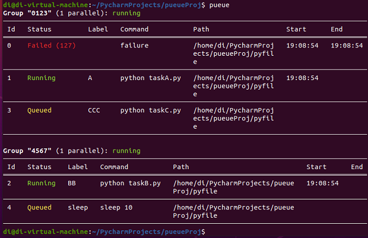
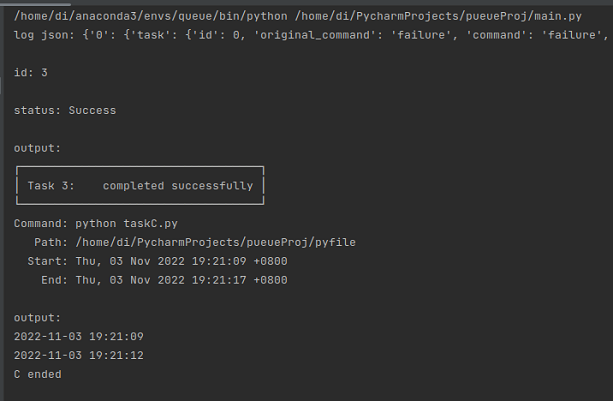

# pueue-demo
Implementation of task scheduling management based on pueue

## Get started
Place the entire project in any path you want. 

To run this demo, you have to download the binaries from _resources_. Place `pueue` and `pueued` in `/usr/bin` and place `pueued.service` in `/etc/systemd/user`.

Start the daemon before using Pueue client. To fork and run `pueued` into the background, just run `pueued -d`. You can run `pueue` then to check whether Pueue client is started or not. Use `chmod` to modify Pueue permissions when necessary.

There are pre prepared scripts in _pyfile_ for a quick example of how this demo works. Just run `bash run.sh` and then you can run `python main.py` to check the result.

## Quick look

## Acknowledgments
* [Pueue](https://github.com/Nukesor/pueue)
